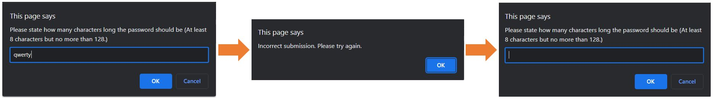

# password-generator

## Description

I wanted to create an application that an employee can use to generate a random password based on the criteria they’ve selected.

This has been achieved by:
* Creating prompts to obtain user input
* Creating functions that check the users input matches requirements (i.e. one character type should be selected) and checks for any user input errors (i.e. that numbers are provided for password length and not letters etc.) The user will be prompted to re-enter their input until it is correct. 

 

* Pulling random characters from the character arrays selected by the user, until the password length is reached. This password is then presented to the user:

## Installation

Please use the following link to access the website: https://e-davies.github.io/password-generator/

## Usage

This application will be used by employees looking to generate a random password that meets their requirements.

## Skills used in this project

